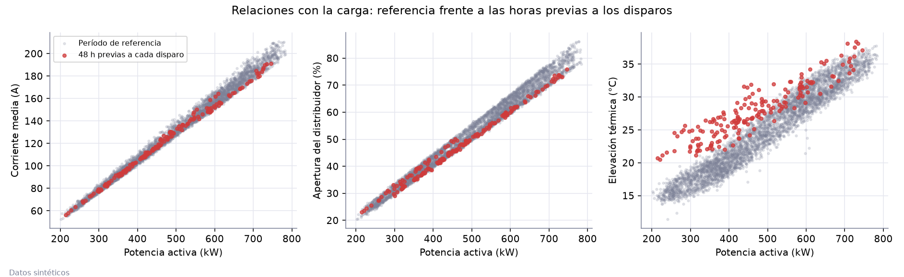
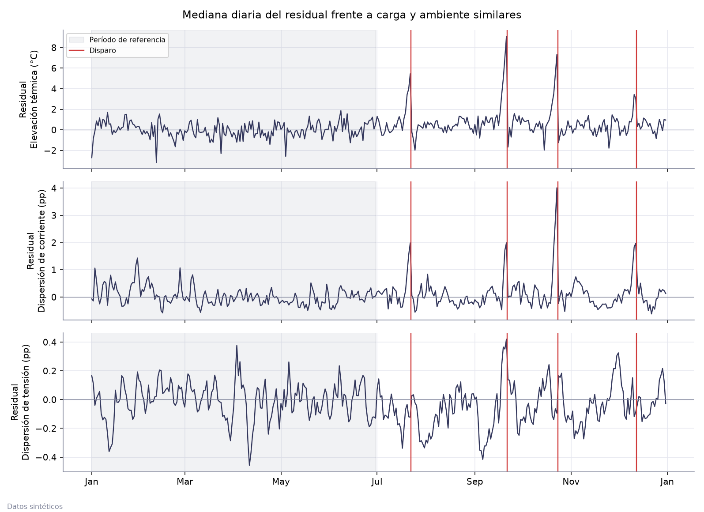
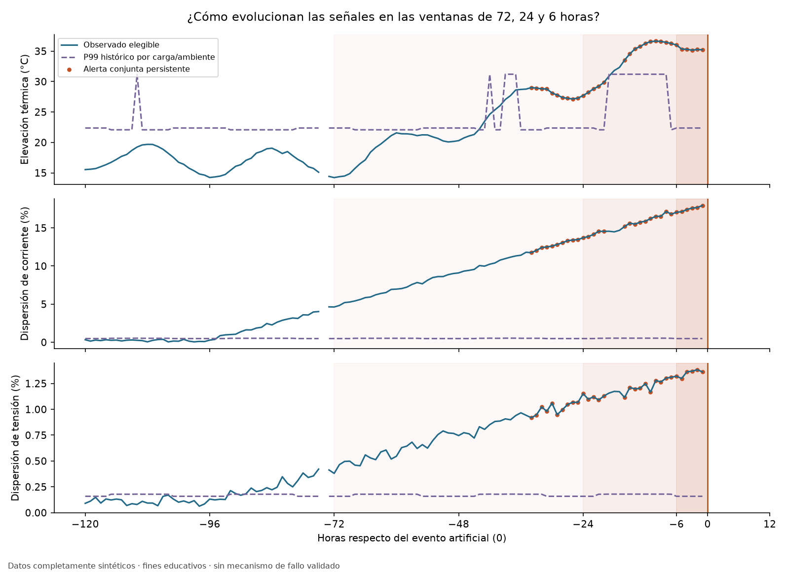
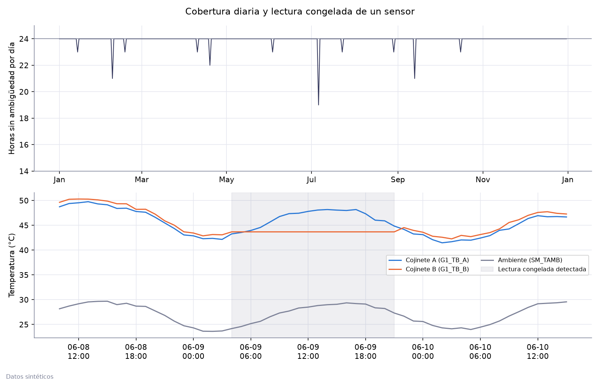

# Análisis de una unidad hidroeléctrica sintética

Año demo generado con la semilla 781. Los datos son sintéticos.

## Calidad y conservación

Se conservan 8762 filas: 8754 mediciones y 8 eventos.
Hay 7 horas con mediciones contradictorias, 9 registros adelantados dos segundos
y 13 horas sin medición. No se interpola ni se deduplica: la selección estadística
(8740 mediciones) excluye las horas ambiguas y los eventos, y el archivo procesado queda intacto.
Una lectura congelada del cojinete B (18 horas idénticas seguidas) excluye esas horas de la comparación.

## Referencia y umbrales

- Generación estable: potencia, corriente, tensión y frecuencia positivas en la hora actual y las tres anteriores.
- Referencia: los primeros 180 días, sin episodios de degradación. Se agrupa por bandas de potencia
  (0–200–300–400–500–600–700–900 kW) y de ambiente (10–26,5–29,5–45 °C), con al menos
  30 observaciones por celda: 16 celdas admitidas, 131 horas sin soporte.
- Indicadores: elevación térmica = media de devanados − ambiente; dispersión = 100 × (máx − mín) / media de las tres fases.
- Umbral: percentil 95 del indicador en su celda de referencia.

| Período | Horas elegibles | Elevación térmica mediana °C | Dispersión de corriente mediana % | Dispersión de corriente P99 % | Dispersión de tensión mediana % | Horas con alarma alta |
|---|---:|---:|---:|---:|---:|---:|
| reference | 4179 | 24,88 | 1,08 | 2,74 | 0,73 | 0 |
| normal_operation | 3765 | 24,64 | 1,06 | 2,43 | 0,65 | 0 |

## Alarmas

La lógica usa los conceptos de gestión de alarmas de ISA-18.2, adaptados a datos horarios:

- **Retardo de activación**: 2 horas seguidas sobre el umbral.
- **Banda muerta**: la alarma se repone al bajar de umbral − 1,0 °C (térmica)
  o umbral − 0,4 pp (dispersión), para que no oscile alrededor del umbral.
- **Prioridad**: baja si un solo indicador está en alarma; alta si ambos lo están a la vez.

Desde el fin de la referencia (4168 horas elegibles, episodios incluidos):

| Tag | Alarma | Prioridad | Activaciones | Por 1000 h | Duración mediana h | Fugaces (≤ 2 h) | Persistentes (≥ 24 h) | Reactivaciones (≤ 6 h) |
|---|---|---|---:|---:|---:|---:|---:|---:|
| `G1_TW_HI` | Elevación térmica sobre su referencia | baja | 106 | 25,43 | 2 | 74 | 2 | 26 |
| `G1_IUNB_HI` | Dispersión de corriente sobre su referencia | baja | 33 | 7,92 | 1 | 23 | 1 | 12 |
| `G1_DEG_HH` | Exceso conjunto de elevación térmica y dispersión de corriente | alta | 14 | 3,36 | 7 | 6 | 1 | 6 |

Sin banda muerta, las mismas alarmas se activan 176 veces y se reactivan 62 veces
en menos de 6 h; con banda muerta, 153 y 44.
Fuera de los episodios hay 103 activaciones en 3765 horas
(0 de prioridad alta).

## Episodios de degradación del año demo

El generador sortea el momento y el tamaño de cada episodio; la regla no los conoce.
La alarma de prioridad alta detecta 4 de 4.
El percentil y el retardo se fijaron con otras semillas; el desempeño sobre 100 años está en [evaluation.md](evaluation.md).

| Evento | Disparo | Rampa h | Severidad | Δ térmico °C | Δ dispersión pp | Detectado | Anticipación h (alta) | Anticipación h (cualquiera) |
|---:|---|---:|---:|---:|---:|---|---:|---:|
| 1 | 2025-07-22 11:00 | 100 | 0,52 | 5,0 | 2,7 | sí | 43 | 70 |
| 2 | 2025-09-21 11:00 | 113 | 0,93 | 9,7 | 3,5 | sí | 33 | 92 |
| 3 | 2025-10-23 17:00 | 95 | 0,86 | 6,2 | 4,5 | sí | 69 | 91 |
| 4 | 2025-12-12 10:00 | 112 | 0,49 | 3,7 | 1,9 | sí | 35 | 99 |

Los incrementos (Δ) son los valores alcanzados al final de la rampa.

## Figuras

Detalle numérico: `analysis_summary.json`, `historical_reference.csv`, `period_comparison.csv`, `event_detection.csv`.
