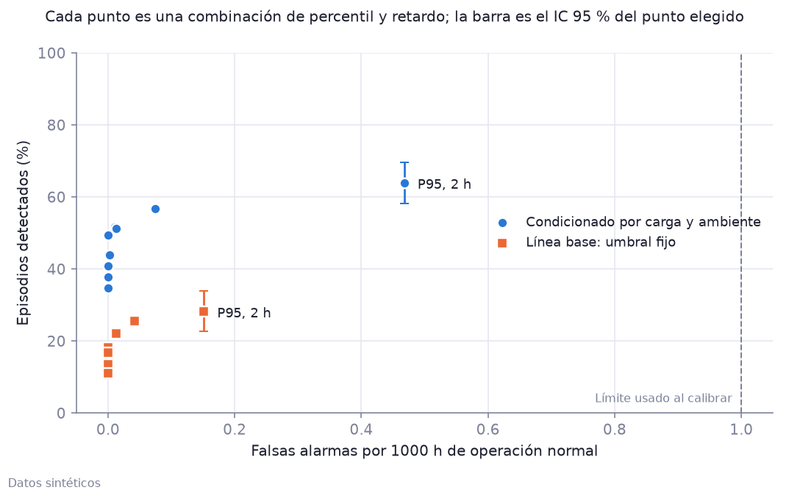
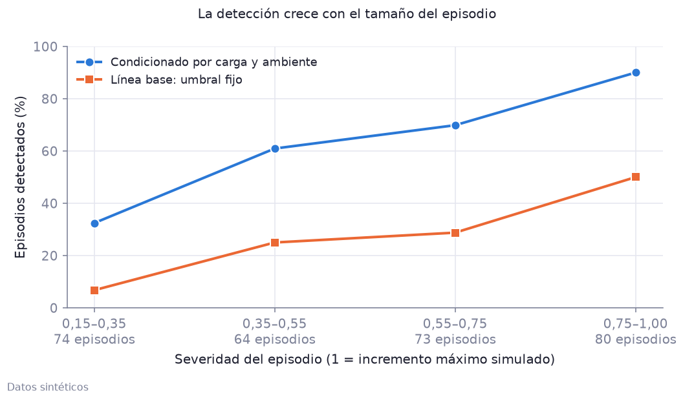
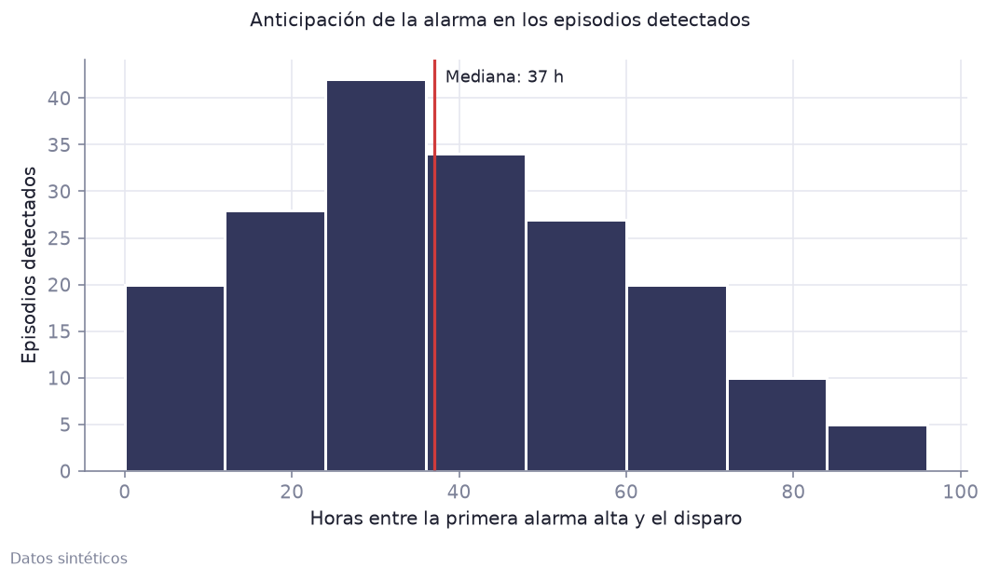

# Evaluación ciega de la regla de alarma

Los datos son sintéticos. Esta evaluación mide la regla sobre 100 simulaciones de un año que no se usaron para ajustarla.

## Protocolo

1. Cada semilla genera un año con 2 a 4 episodios de degradación en momentos y tamaños sorteados.
2. Los umbrales de cada año salen de sus primeros 180 días. El detector no recibe la lista de episodios.
3. Con 20 semillas de calibración se eligió percentil y retardo con una regla fijada de antemano:
   la mayor detección con un máximo de 1 falsa alarma por 1000 h. Resultado: **P95 y 2 h**.
4. Esa configuración se aplicó a 100 semillas de evaluación distintas y se comparó con la verdad.

Un episodio cuenta como detectado si la alarma de prioridad alta está activa en algún momento entre el inicio de su rampa y el disparo.
Una falsa alarma es una activación fuera de las rampas y de las paradas posteriores.
Los intervalos son del 95 %, por remuestreo de años completos (2000 repeticiones).

## Resultado

| Método | Detección [IC 95 %] | Episodios | Falsas alarmas por 1000 h [IC 95 %] | Horas normales en alarma | Anticipación mediana h [IC 95 %] | Anticipación P10–P90 h |
|---|---|---:|---|---:|---|---|
| Condicionado por carga y ambiente | 64 % [58; 70] | 186/291 | 0,47 [0,38; 0,56] | 0,08 % | 37 [31; 41] | 11–70 |
| Condicionado solo por carga | 60 % [54; 66] | 174/291 | 0,10 [0,07; 0,14] | 0,02 % | 32 [29; 36] | 9–65 |
| Línea base: umbral fijo | 28 % [23; 34] | 82/291 | 0,15 [0,11; 0,20] | 0,04 % | 30 [24; 38] | 4–67 |

Diferencia entre el método condicionado y la línea base, con los mismos años:
detección 36 puntos [30; 42],
falsas alarmas 0,32 por 1000 h [0,24; 0,40].
El intervalo excluye el cero: condicionar por carga y ambiente detecta más episodios que un umbral fijo.

## Detección según el tamaño del episodio

| Severidad | Episodios | Condicionado | Línea base |
|---|---:|---:|---:|
| 0,15–0,35 | 74 | 32 % | 7 % |
| 0,35–0,55 | 64 | 61 % | 25 % |
| 0,55–0,75 | 73 | 70 % | 29 % |
| 0,75–1,00 | 80 | 90 % | 50 % |

## Sensibilidad al percentil y al retardo

Sobre las semillas de evaluación. Esta tabla es informativa: no se usó para elegir la configuración.

| Percentil | Retardo h | Detección (condicionado) | Falsas alarmas / 1000 h | Anticipación mediana h | Detección (base) | Falsas alarmas / 1000 h (base) |
|---|---:|---:|---:|---:|---:|---:|
| P95 | 2 | 64 % | 0,47 | 37 | 28 % | 0,15 |
| P95 | 3 | 57 % | 0,07 | 31 | 25 % | 0,04 |
| P95 | 4 | 52 % | 0,01 | 28 | 22 % | 0,01 |
| P99 | 2 | 51 % | 0,01 | 28 | 18 % | 0,00 |
| P99 | 3 | 44 % | 0,00 | 23 | 16 % | 0,00 |
| P99 | 4 | 38 % | 0,00 | 22 | 14 % | 0,00 |
| P99.5 | 2 | 49 % | 0,00 | 25 | 17 % | 0,00 |
| P99.5 | 3 | 41 % | 0,00 | 21 | 13 % | 0,00 |
| P99.5 | 4 | 35 % | 0,00 | 19 | 11 % | 0,00 |

Tabla usada para elegir, con las semillas de calibración (método condicionado):

| Percentil | Retardo h | Detección | Falsas alarmas / 1000 h |
|---|---:|---:|---:|
| P95 | 2 | 77 % | 0,62 |
| P95 | 3 | 65 % | 0,10 |
| P95 | 4 | 62 % | 0,01 |
| P99 | 2 | 62 % | 0,05 |
| P99 | 3 | 57 % | 0,03 |
| P99 | 4 | 57 % | 0,01 |
| P99.5 | 2 | 60 % | 0,00 |
| P99.5 | 3 | 57 % | 0,00 |
| P99.5 | 4 | 55 % | 0,00 |

## Revisión de alarmas (ISA-18.2)

Activaciones desde el fin de la referencia en los años de evaluación (415370 horas elegibles):

| Tag | Prioridad | Activaciones | Por 1000 h | Fugaces (≤ 2 h) | Persistentes (≥ 24 h) | Reactivaciones (≤ 6 h) | Reactivaciones sin banda muerta |
|---|---|---:|---:|---:|---:|---:|---:|
| `G1_TW_HI` | baja | 11272 | 27,14 | 6705 | 136 | 2307 | 2893 |
| `G1_IUNB_HI` | baja | 3676 | 8,85 | 2258 | 94 | 1131 | 1606 |
| `G1_DEG_HH` | alta | 671 | 1,62 | 325 | 63 | 222 | 394 |

- Tasa total: 0,038 activaciones por hora para esta unidad. La referencia habitual de ISA-18.2 y EEMUA 191
  es de hasta unas 12 por hora por operador para toda la planta.
- La banda muerta reduce las activaciones de 17179 a 15619 y las reactivaciones de 4893 a 3660.
- El 4 % de las activaciones es de prioridad alta (referencia habitual: en torno al 5 % en el nivel más alto).
- Si también se cuenta la prioridad baja como detección, se detecta el 100 % de los episodios,
  con 31,99 falsas alarmas por 1000 h: por eso la baja informa y la alta pide acción.

Los datos son horarios, así que los tiempos de la norma (segundos y minutos) están escalados a horas.
Referencias: [Alarm management by the numbers](https://www.chemengonline.com/alarm-management-numbers/) y
[Why should I use an alarm deadband](https://www.exida.com/Blog/why-should-i-use-an-alarm-deadband).

## Alcance

La evaluación es ciega respecto a cuándo ocurre cada episodio y a su tamaño, pero el mismo autor diseñó el generador
y el detector: el tipo de degradación (rampa lineal en temperatura y desbalance) es conocido. Los resultados describen
este escenario sintético y no una instalación real.

Detalle numérico: `evaluation_summary.json`, `evaluation_methods.csv`, `evaluation_sensitivity.csv`.
